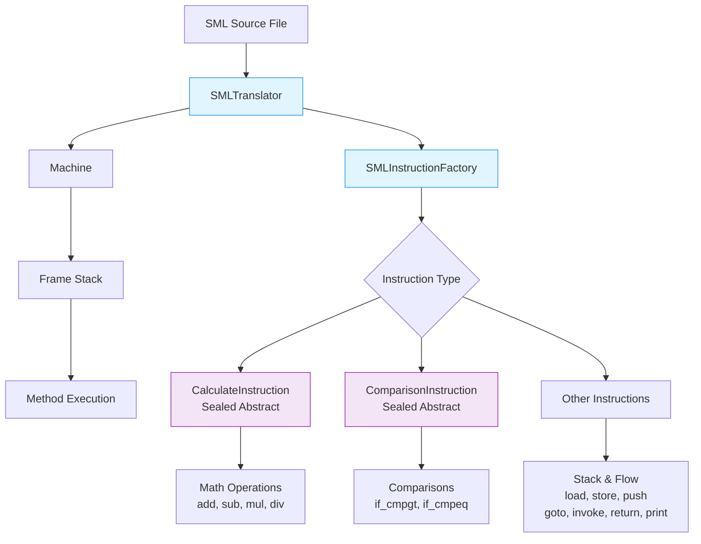

# 🖥️ Simple Machine Language (SML) Interpreter

A stack-based interpreter written in Java, demonstrating software engineering principles including reflection API, dependency injection, and object-oriented design patterns.


## 📋 Table of Contents

- [🚀 Project Overview](#-project-overview)
- [🏗️ Architecture](#️-architecture)
- [📝 SML Language Features](#-sml-language-features)
- [🛠️ Technical Implementation Highlights](#️-technical-implementation-highlights)
- [🚀 Getting Started](#-getting-started)
- [📁 Project Structure](#-project-structure)
- [🧪 Testing](#-testing)
- [🎯 Design Patterns and Concepts](#-design-patterns-and-concepts-implemented)
- [🔧 Technologies Used](#-technologies-used)
- [📈 Learning Outcomes](#-learning-outcomes)
- [🤝 Extending the Interpreter](#-extending-the-interpreter)
- [📧 Contact](#-contact)
- [🙏 Acknowledgements](#-acknowledgements)

## 🚀 Project Overview

SML is a simple assembly-like programming language interpreter that operates on a stack-based execution model. The project demonstrates object-oriented design principles, reflection usage, and dependency injection patterns.

### Key Features

- **🏗️ Stack-based Execution**: Implements an execution environment with method frames, operand stacks, and program counters
- **⚙️ Complete Instruction Set**: Supports arithmetic operations, control flow, method invocation, and variable management
- **🔍 Reflection-based Instruction Factory**: Uses Java reflection to instantiate instruction objects dynamically
- **🌱 Spring Dependency Injection**: Uses Spring Framework for component management
- **🧬 Abstract Class Hierarchies**: Implements sealed classes and inheritance patterns to reduce code duplication
- **🧪 Comprehensive Testing**: Unit tests for instruction implementations and core components

## 🏗️ Architecture

The interpreter follows a layered architecture for executing SML programs:



### Core Components

- **`Machine`**: Executes the fetch-decode-execute cycle and manages program execution
- **`Frame`**: Represents method execution context with local variables and operand stack
- **`SMLTranslator`**: Parses SML source code and builds the internal program representation
- **`SMLInstructionFactory`**: Uses reflection to dynamically instantiate instruction objects
- **`Instruction`** (Abstract): Base class for all SML instructions with polymorphic execution
- **`CalculateInstruction`** (Sealed): Abstract base for arithmetic instructions
- **`ComparisonInstruction`** (Sealed): Abstract base for comparison instructions

## 📝 SML Language Features

### Instruction Set

| Category | Instructions | Description |
|----------|--------------|-------------|
| **Arithmetic** | `add`, `sub`, `mul`, `div` | Basic mathematical operations |
| **Stack Operations** | `push`, `load`, `store` | Stack and variable manipulation |
| **Control Flow** | `goto`, `if_cmpgt`, `if_cmpeq` | Branching and jumps |
| **Method Management** | `invoke`, `return` | Method calls and returns |
| **I/O** | `print` | Output operations |

### Example Program

Here's a recursive Fibonacci implementation in SML:

```sml
@main:
   push 10
   invoke @fib
   print
   push 1
   return

@fib: n
    load n
    push 1
    if_cmpgt L7
    push 1
    return
L7: load n
    push 1
    sub
    invoke @fib
    load n
    push 2
    sub
    invoke @fib
    add
    return
```

## 🛠️ Technical Implementation Highlights

### 1. Reflection-Based Instruction Factory
The instruction factory uses reflection to dynamically instantiate instructions based on opcode:

```java
// Dynamically find and instantiate instruction classes
for (Class<?> instruction : instructionClasses) {
    Field[] fields = instruction.getDeclaredFields();
    for (Field field : fields) {
        if (field.getName().equals("OP_CODE")) {
            String opcodeValue = String.valueOf(field.get(null));
            if (opcodeValue.equals(opcode)) {
                return buildInstruction(label, programInstruction, instruction);
            }
        }
    }
}
```

### 2. Spring Dependency Injection Configuration
```xml
<bean id="instruction-factory" class="sml.SMLInstructionFactory">
    <constructor-arg>
        <list>
            <value>sml.instruction.AdditionInstruction</value>
            <value>sml.instruction.LoadInstruction</value>
            <!-- Additional instruction types configured in beans.xml -->
        </list>
    </constructor-arg>
</bean>
```

### 3. Sealed Class Hierarchies
Using modern Java sealed classes to control inheritance:

```java
public sealed abstract class CalculateInstruction extends Instruction
        permits AdditionInstruction, DivisionInstruction, 
                MultiplicationInstruction, SubtractionInstruction {
    
    // Pattern matching with switch expressions
    Function<CalculateInstruction,Integer> calculate = c ->
        switch (c) {
            case AdditionInstruction a -> Math.addExact(a.value1, a.value2);
            case SubtractionInstruction s -> Math.subtractExact(s.value1, s.value2);
            case MultiplicationInstruction m -> Math.multiplyExact(m.value1, m.value2);
            case DivisionInstruction d -> d.value1 / d.value2;
        };
}
```

## 🚀 Getting Started

### Prerequisites

- **Java 21** or higher
- **Maven 3.6+**

### Local Development Setup

1. **Clone the repository**
   ```bash
   git clone https://github.com/yourusername/sml-interpreter.git
   cd sml-interpreter
   ```

2. **Install dependencies and compile**
   ```bash
   mvn clean compile
   ```

3. **Run sample programs**
   ```bash
   # Fibonacci example (calculates 10th Fibonacci number)
   java -cp target/classes RunSml resources/test1.sml
   
   # Alternative implementation example
   java -cp target/classes RunSml resources/test2.sml
   ```

4. **Run all tests**
   ```bash
   mvn test
   ```

5. **Generate test reports**
   ```bash
   mvn surefire-report:report
   # View reports in target/site/surefire-report.html
   ```

### IDE Setup

**IntelliJ IDEA / Eclipse:**
1. Import as Maven project
2. Set Project SDK to Java 21
3. Enable annotation processing for Spring
4. Run configuration: Main class `RunSml`, Program arguments `resources/test1.sml`

## 📁 Project Structure

```
src/
├── main/java/
│   ├── RunSml.java                    # Main entry point
│   └── sml/
│       ├── Machine.java               # Interpreter execution engine
│       ├── Frame.java                 # Execution frame
│       ├── Instruction.java           # Abstract instruction base
│       ├── SMLTranslator.java         # Source code parser
│       ├── SMLInstructionFactory.java # Reflection-based factory
│       └── instruction/               # Instruction implementations
│           ├── CalculateInstruction.java    # Sealed abstract class
│           ├── ComparisonInstruction.java   # Sealed abstract class
│           ├── AdditionInstruction.java     # Concrete arithmetic
│           ├── LoadInstruction.java         # Variable operations
│           └── [other instructions...]
└── test/
    └── sml/                          # Unit tests
        ├── instruction/              # Instruction-specific tests
        ├── MachineTest.java
        ├── MethodTest.java
        └── SymbolTableTest.java
resources/
├── beans.xml                         # Spring DI configuration  
├── test1.sml                         # Fibonacci example
└── test2.sml                         # Additional examples
```

## 🧪 Testing

The project includes comprehensive unit tests covering:

### Test Coverage
- **Instruction Tests**: `CalculateInstructionTest`, `ComparisonInstructionTest`, `LoadInstructionTest`
- **Core Functionality**: `MachineTest`, `MethodTest`, `SymbolTableTest`
- **Integration Tests**: End-to-end program execution

### Running Tests

```bash
# Run all tests
mvn test

# Run specific test class
mvn test -Dtest=CalculateInstructionTest

# Run tests with verbose output
mvn test -Dtest=* -DforkCount=1 -DreuseForks=false

# Generate coverage report
mvn jacoco:report
```

### Example Test Scenarios
- ✅ **Arithmetic Operations**: Addition, subtraction, multiplication, division
- ✅ **Control Flow**: Conditional branching, goto statements  
- ✅ **Method Invocation**: Recursive calls, parameter passing
- ✅ **Variable Management**: Load/store operations, scope handling
- ✅ **Error Handling**: Invalid operations, stack underflow

## 🎯 Design Patterns and Concepts Implemented

- **🏭 Abstract Factory**: `SMLInstructionFactory` for creating instruction instances
- **🔒 Sealed Classes**: `CalculateInstruction` and `ComparisonInstruction` with controlled inheritance
- **📋 Template Method**: Abstract instruction classes defining execution patterns
- **💉 Dependency Injection**: Spring-managed components (`@Component`, `@Autowired`)
- **🔍 Reflection**: Dynamic class loading and field access for instruction creation
- **🎯 Pattern Matching**: Modern Java switch expressions with sealed classes

## 🔧 Technologies Used

### Core Technologies
- **Java 21**: Modern Java features including sealed classes and pattern matching
- **Spring Boot 3.4.3**: Dependency injection framework
- **Spring Context**: Bean management and configuration
- **Maven**: Build automation and dependency management

### Testing & Quality
- **JUnit**: Unit testing framework
- **Java Reflection API**: Dynamic class loading and field access

## 📈 Learning Outcomes

This project demonstrates:

- **🔧 Modern Java Features**: Sealed classes, pattern matching, switch expressions
- **🏗️ Object-Oriented Design**: Abstract classes, inheritance hierarchies, polymorphism
- **🔍 Reflection API**: Dynamic class loading, field access, constructor invocation
- **🌱 Spring Framework**: Dependency injection, component scanning, XML configuration
- **🏛️ Software Architecture**: Clean separation of concerns, extensible design
- **🧪 Testing**: Unit test coverage with JUnit
- **⚙️ Build Tools**: Maven project structure and dependency management

## 🤝 Extending the Interpreter

The architecture allows easy extension by:

1. **Creating new instruction classes** extending the appropriate abstract base
2. **Adding the class name** to the Spring beans configuration
3. **The reflection-based factory** automatically handles instantiation

### Example: Adding a Modulo Operation

```java
public non-sealed class ModuloInstruction extends CalculateInstruction {
    public static final String OP_CODE = "mod";
    
    public ModuloInstruction(Label label) { 
        super(label, OP_CODE); 
    }
}
```

Then add to `beans.xml`:
```xml
<value>sml.instruction.ModuloInstruction</value>
```

## 📧 Contact

**Queenie Lee** - Software Developer  
📧 queenie.lee[at]live.ca  
🔗 [GitHub Portfolio](https://github.com/queenie-lee)  
💼 [Project Repository](https://github.com/queenie-lee/java-sml-interpreter)

## 🙏 Acknowledgements

This project demonstrates advanced Java programming concepts within a provided educational framework from the **Software Design and Programming** course.

### Architecture & Implementation

**Framework Foundation**: Built upon a robust architectural skeleton including core VM components (`Machine`, `Frame`, `Method`, `SymbolTable`) and parsing infrastructure, allowing focus on advanced implementation techniques.

#### 🔧 **Key Technical Implementations:**
- **Instruction System**: Complete implementation of all concrete instruction classes with polymorphic execution
- **Sealed Class Hierarchies**: `CalculateInstruction` and `ComparisonInstruction` using modern Java pattern matching
- **Reflection-Based Factory**: Dynamic instruction instantiation using Java reflection API
- **Spring Integration**: Dependency injection implementation with `@Component` and `@Autowired` patterns  
- **Testing Suite**: Comprehensive unit tests covering instruction implementations and core functionality
- **Modern Java Features**: Leveraged Java 21 sealed classes, pattern matching, and switch expressions

#### 🎯 **Technical Focus Areas:**
- **Code Extension & Modification**: Working with existing architectural patterns
- **Advanced OOP**: Abstract class hierarchies and polymorphic design
- **Reflection API**: Dynamic object creation and field access
- **Dependency Injection**: Spring Framework integration patterns
- **Test-Driven Development**: Comprehensive unit test coverage

### Resources & Documentation

- **Java Language Specifications** for sealed classes and pattern matching implementation
- **Spring Framework Documentation** for dependency injection best practices  
- **Course Materials** for foundational architecture and advanced Java concepts

**Note**: This project showcases the ability to work with existing codebases while implementing sophisticated features - a crucial skill in professional software development.

---

**Built with ❤️ using Java 21, Spring Framework, and Maven** 

Stack-based interpreter for SML assembly language in Java. Features reflection API, Spring dependency injection, sealed classes, and modern design patterns. Demonstrates advanced OOP and enterprise development practices. 